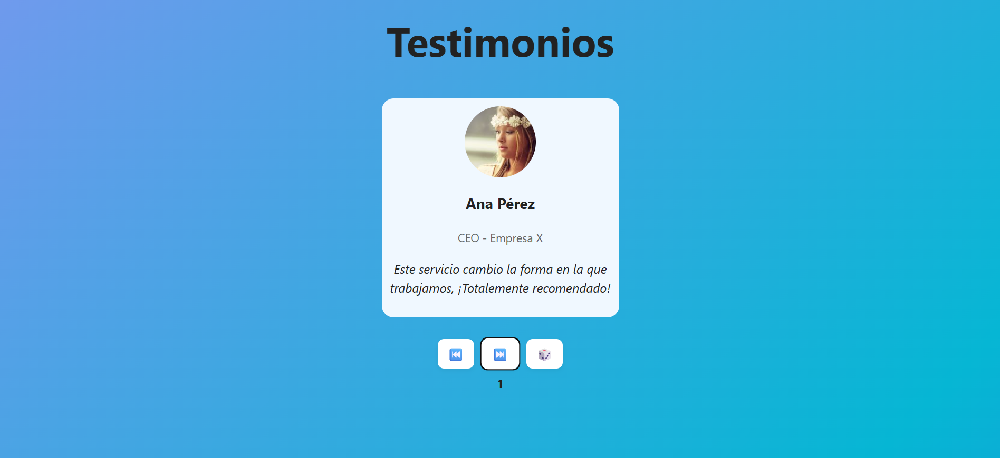

# 🗣️ Carrusel de Testimonios - React + Vite

Este proyecto es una aplicación sencilla desarrollada con **React** y **Vite**, que muestra un **carrusel de testimonios** con rotación automática y controles manuales.  
Incluye navegación **anterior**, **siguiente**, **aleatoria** y un **autoplay** que cambia de testimonio cada 5 segundos.

---

## 🚀 Características principales

- ✅ Navegación entre testimonios (anterior / siguiente)
- 🎲 Selección aleatoria de testimonio
- 🔁 Rotación automática cada 5 segundos
- 🧭 Reinicio automático del autoplay tras interacción del usuario
- ⚡ Configurado con **Vite** para un desarrollo rápido
- 💅 Estilos simples y personalizables con CSS

---

## 🧩 Estructura del proyecto
```
src/
├── assets/
│ ├── react.svg
│ └── vite.svg
├── components/
│ ├── Testimonial.jsx # Componente que muestra un testimonio individual
│ └── Controls.jsx # Botones de control (prev, next, random)
├── data.js # Array con los testimonios
├── App.jsx # Componente principal con la lógica del carrusel
├── App.css # Estilos básicos
└── main.jsx # Punto de entrada de React
```
---

## 💻 Interfaz

